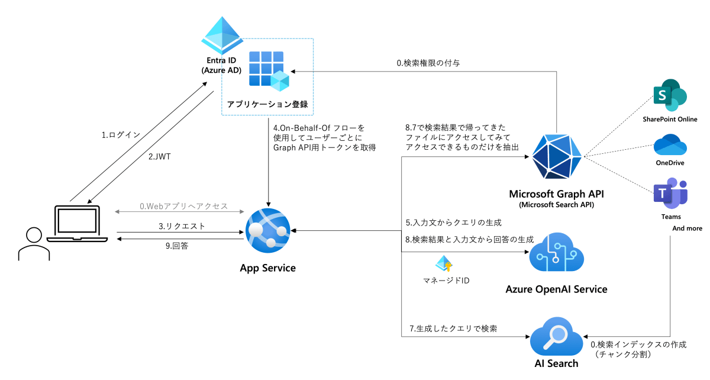
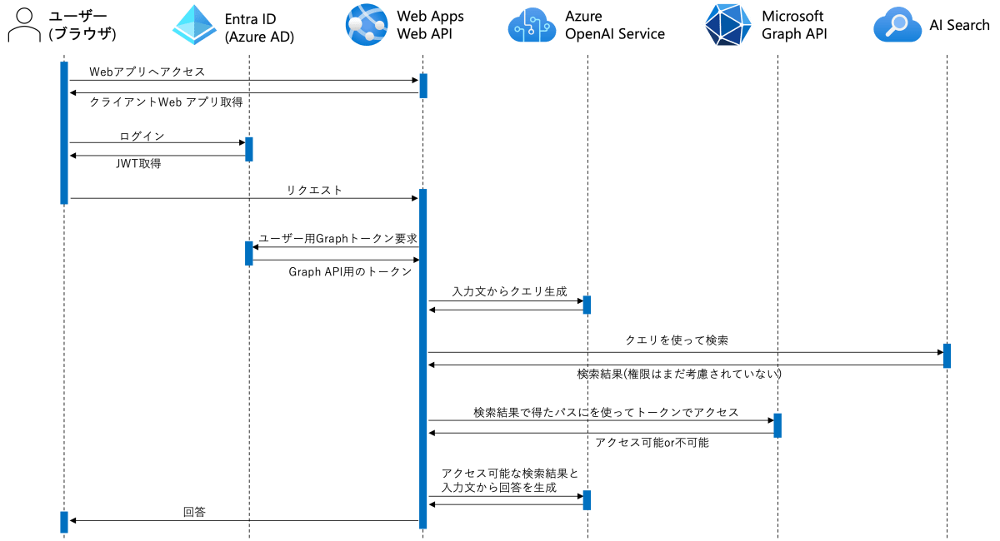

[English](./README_en.md)

# Microsoft Search API RAG サンプルアプリ


このサンプルは[Azure-Samples/azure-search-openai-demo](https://github.com/Azure-Samples/azure-search-openai-demo)をベースに開発されています。

> **Note**
> Note:このサンプルで使用されているMicrosoft Graph SDK for Pythonは現在[プレビュー段階](https://learn.microsoft.com/ja-jp/graph/sdks/sdks-overview#supported-languages)です。


## 概要
<!--ここにスクショを入れる-->

### 機能
- Microsoft 365内のドキュメントやサイト、Teamsの投稿などを基にしたLLMによるチャット形式の内部ナレッジ検索
- Azure AI Search を使用した高精度なRAGアーキテクチャ
- [On-Behalf-Of フロー](https://learn.microsoft.com/ja-jp/entra/identity-platform/v2-oauth2-on-behalf-of-flow)を使用した元データに付与されたユーザーごとの権限に応じた検索


### 技術概要
アーキテクチャ


シーケンス


###　現時点での制限
- Citationタブでの参考文書の参照は、ブラウザにMicrosoft Edgeのみで動作します。その他のブラウザはiframeによる認証情報の伝播の制限により動作しません。 (https://github.com/07JP27/azureopenai-internal-microsoft-search/issues/12)
- 現在はStreamingモードを実装していません。(https://github.com/07JP27/azureopenai-internal-microsoft-search/issues/9)

## セットアップ方法
### 前提条件
- このリポジトリをクローンまたはダウンロード
- Azure OpenAI ServiceまたはOpenAIの準備
    - Completionモデル `gpt-4o` をデプロイ
    - Embeddingモデル `text-embedding-3-small` をデプロイ
    - OpenAI：APIキーを取得（Azure OpenAI Serviceを使用する場合は、マネージドID認証をするため不要）
- Azure AI Searchの準備
    - Azure AI Searchの作成（本サンプルアプリでは、Basic プランを使用して動作を確認）
    - ロールベースのアクセス制御を有効化
- ローカル実行を行う場合は以下の環境がローカルマシンに準備されていること
    - Python
    - Node.js
    - Azure CLI

### 1.アプリケーション登録
1. [Azure Portal](https://portal.azure.com/)にログインします。
1. [Microsoft Entra ID](https://portal.azure.com/#view/Microsoft_AAD_IAM/ActiveDirectoryMenuBlade/~/Overview) > アプリの登録 の順に選択していき、アプリ登録一覧画面で「新規登録」を選択します。
1. 「名前」を入力します。（例：ChatGPT-GraphSearch）
1. 「サポートされているアカウントの種類」で「この組織ディレクトリのみに含まれるアカウント」を選択
1. 「リダイレクトURI」でプラットフォームを「シングルページアプリケーション(SPA)」、URIを「http://localhost:5173/redirect」に設定します。
1. 「登録」をクリックします。
1. 登録されたアプリ登録に移動し、ブレードメニューの「APIのアクセス許可」にアクセスします。
1. 「アクセス許可の追加」から「Microsoft Graph」>「委任されたアクセス許可」の順に選択していき「Files.Read.All」と「Sites.Read.All」にチェックを入れて「アクセス許可の追加」を選択します。
1. アクセス許可一覧に選択したアクセス許可がリストアップされていることを確認します。
1. ブレードメニューから「APIの公開」を選択して「アプリケーション ID の URI」の「追加」をクリックします。
1. 表示される「api://{UUID}」の状態のまま「保存」を選択します。
1. 同ページの「Scopeの追加」を選択します。
1. スコープ名に「access_as_user」と入力してその直下に「api://{UUID}/access_as_user」と表示されるようにするします。
1. 同意できる対象で「管理者とユーザー」を選択します。
1. そのほかの表示名や説明は任意の文章（＝初回ログイン時に委任を求める画面で表示される内容）を入力して「スコープの追加」を選択します。
1. ブレードメニューから「証明書とシークレット」を選択します。「新しいクライアントシークレット」を選択してクライアントシークレットを任意の説明と期間で追加します。
1. 作成されたシークレットの「値」をメモ帳などにコピーします。**シークレットの値は作成直後しか表示されません。メモせずに画面遷移をすると２度と表示できないのでご注意ください。**
1. ブレードメニューから「概要」を選択して表示される次の情報をメモ帳などにコピーします。
    - ディレクトリ(テナント)ID
    - アプリケーション(クライアント)ID

### 2. プロンプト調整
用途に応じて以下のファイルの`system_message_chat_conversation`、`query_prompt_template`、`query_prompt_few_shots`に記述されているプロンプトを調整します。
https://github.com/07JP27/azureopenai-internal-microsoft-search/blob/52053b6c672a32899b5361ae3510dbe0c40693c6/src/backend/approaches/chatreadretrieveread.py#L29

### 3.ローカル実行
1. 下記の内容に従って、ローカル実行ユーザーにRBACロールを付与します。**すでに共同作成者がついている場合でも必ず別途付与してください**

    | ロール名                        | 対象サービス         | 役割                          |
    |---------------------------------|----------------------|-------------------------------|
    | Cognitive Services OpenAI User  | Azure OpenAI Service | 回答の生成, ベクトル埋め込み  |
    | Search Service Contributor      | Azure AI Search     | Search Serviceの管理       |
    | 検索インデックス データ共同作成者  | Azure AI Search      | インデックスデータの作成と読込 |

1. ターミナルで`az login`を実行してAzure OpenAI ServiceのリソースのRBACに登録したアカウントでAzureにログインします。
1. ターミナルなどでクローンしたファイルの「src/backend」に移動して「pip install -r requirements.txt」を実行します。パッケージのインストールが完了するまでしばらく待ちます。
1. 別ターミナルなどを開きクローンしたファイルの「src/frontend」に移動して「npm install」を実行します。パッケージのインストールが完了するまでしばらく待ちます。
1. 「src/backend」内に.envファイルを作成して[.env-sample](./src/backend/.env-sample)に記載されている内容をコピーします。
1. それぞれの環境変数にメモした情報などを入力します。
1. 「src/backend」を開いているターミナルで「quart run」を実行します。
1. 「src/frontend」を開いているターミナルで「npm run dev」を実行します。
1. ブラウザで「http://localhost:5173/」にアクセスします。
1. 画面右上の「Login」ボタンをクリックして、アプリ登録を行ったディレクトリのユーザーアカウントでログインします。ログインに成功したら「Login」と表示されていた部分にユーザーのUPNが表示されます。
1. 入力エリアに質問を入力してチャットを開始します。

### 4.Azureへのデプロイ
1. App Service にアプリケーションをデプロイし設定を行います。
    1. Azure にログインします。
    ```
    az login
    ```

    2. リソースグループを作成します(Azure OpenAI を使用する場合、同じリソースグループを使用してください)。
    ```
    az group create --name <リソースグループ名> --location <リージョン>
    ```

    3. App Serviceプランを作成します。今回は Basic B1 を使用していますが、必要に応じて変更してください。
    ```
    az appservice plan create --name <App Serviceプラン名> --resource-group <リソースグループ名> --sku B1 --is-linux
    ```

    4. App Serviceを作成します。
    ```
    az webapp create --resource-group <リソースグループ名> --plan <App Serviceプラン名> --name <App Service名> --runtime "PYTHON|3.11" --deployment-local-git
    ```

    5. App Serviceにデプロイするために、下記のコマンドでデプロイするためのファイルをzip化します。
    ```
    # フロントエンドのビルド
    cd src/frontend
    npm install
    npm run build

    # バックエンドのzip化
    cd ../backend
    zip -r ./app.zip .
    ```

    6. デプロイ用のzipファイルを作成したら、App Serviceにデプロイします。
    ```
    az webapp deployment source config-zip --resource-group <リソースグループ名> --name <App Service名> --src app.zip
    ```

    7. App Serviceに必要な設定をします。環境変数の設定では、.envファイルに記載されている内容およびSCM_DO_BUILD_DURING_DEPLOYMENTをtrueに設定します。
    ```
    # スタートアップコマンドの設定
    az webapp config set --resource-group <リソースグループ名> --name <App Service名> --startup-file "python3 -m gunicorn main:app"


    # 環境変数の設定
    az webapp config appsettings set --name <App Service名> --resource-group <リソースグループ名> --settings \
    SCM_DO_BUILD_DURING_DEPLOYMENT=true \
    AZURE_OPENAI_CHATGPT_MODEL=<Azure OpenAI のモデル名> \
    AZURE_OPENAI_SERVICE=<Azure OpenAI Serviceのリソース名> \
    AZURE_OPENAI_CHATGPT_DEPLOYMENT=<Azure OpenAI のモデルのデプロイ名> \
    AZURE_USE_AUTHENTICATION="true" \
    AZURE_SERVER_APP_ID=<アプリケーションID> \
    AZURE_SERVER_APP_SECRET=<アプリケーションシークレット> \
    AZURE_CLIENT_APP_ID=<アプリケーションID> \
    AZURE_TENANT_ID=<テナントID> \
    TOKEN_CACHE_PATH="None"
    ```

    8. App Service が Azure OpenAI Service と Azure AI Search にアクセスできるよう、App Service に以下の RBAC ロールを付与します。

        | ロール名                        | 対象サービス         | 役割                          |
        |---------------------------------|----------------------|-------------------------------|
        | Cognitive Services OpenAI User  | Azure OpenAI Service | 回答の生成, ベクトル埋め込み  |
        | Search Service Contributor       | Azure AI Search      | Search Serviceの管理         |
        | 検索インデックス データ閲覧者     | Azure AI Search      | インデックスデータの読込      |

        下記に示すコマンドを順に実行してください。
        ```
        # App ServiceのマネージドIDを有効化する
        az webapp identity assign --resource-group <リソースグループ名> --name <App Service名> 

        # App ServiceのマネージドIDに対応したオブジェクトIDを取得する
        role=$(az webapp identity show --resource-group <リソースグループ名> --name <App Service名> --query principalId -o tsv)

        # PowerShellで実行する場合
        $role = az webapp identity show --resource-group <リソースグループ名> --name <App Service名> --query principalId -o tsv

        # App ServiceのマネージドIDに対して、Azure OpenAI Serviceのアクセス権限を付与する
        az role assignment create --role "Cognitive Services OpenAI User" --assignee $role --scope /subscriptions/<サブスクリプションID>/resourceGroups/<リソースグループ名>

        # App ServiceのマネージドIDに対して、Azure AI Search のリソース管理権限を付与する
        az role assignment create --role "Search Service Contributor" --assignee $role --scope /subscriptions/<サブスクリプションID>/resourceGroups/<リソースグループ名>/providers/Microsoft.Search/searchServices/<Azure AI Searchのサービス名>

        # App ServiceのマネージドIDに対して、Azure AI Search のインデックスデータ閲覧権限を付与する
        az role assignment create --role "Search Index Data Reader" --assignee $role --scope /subscriptions/<サブスクリプションID>/resourceGroups/<リソースグループ名>/providers/Microsoft.Search/searchServices/<Azure AI Searchのサービス名>

        ```

9. Azure AI Searchにインデックスを作成します。

    1. OneDriveもしくはSharepointからRAGに使用するファイルを必要な数だけダウンロードします。
    2. `src/backend/indexing/files/original` ディレクトリにダウンロードした全てのファイルを配置します。
    3. `src/backend/indexing` ディレクトリで、`python3 convert_markdown.py` を実行します。これにより、`src/backend/indexing/files/markdown` ディレクトリにMarkdown形式のファイルが生成されます。
    4. [Graph ExplorerからsearchEntityのクエリを実行](https://developer.microsoft.com/en-us/graph/graph-explorer?request=search%2Fquery&method=POST&version=v1.0&GraphUrl=https://graph.microsoft.com&requestBody=Ilwie1xcclxcbiAgXFxcInJlcXVlc3RzXFxcIjogW1xcclxcbiAgICB7XFxyXFxuICAgICAgXFxcImVudGl0eVR5cGVzXFxcIjogW1xcclxcbiAgICAgICAgXFxcImV4dGVybmFsSXRlbVxcXCJcXHJcXG4gICAgICBdLFxcclxcbiAgICAgIFxcXCJjb250ZW50U291cmNlc1xcXCI6IFtcXHJcXG4gICAgICAgIFxcXCIvZXh0ZXJuYWwvY29ubmVjdGlvbnMvY29ubmVjdGlvbmZyaWVuZGx5bmFtZVxcXCJcXHJcXG4gICAgICBdLFxcclxcbiAgICAgICBcXFwicmVnaW9uXFxcIjogXFxcIlVTXFxcIixcXHJcXG4gICAgICAgXFxcInF1ZXJ5XFxcIjoge1xcclxcbiAgICAgICAgXFxcInF1ZXJ5U3RyaW5nXFxcIjogXFxcInRlc3RcXFwiXFxyXFxuICAgICAgfSxcXHJcXG4gICAgICBcXFwiZnJvbVxcXCI6IDAsXFxyXFxuICAgICAgXFxcInNpemVcXFwiOiAyNSxcXHJcXG4gICAgICBcXFwiZmllbGRzXFxcIjogW1xcclxcbiAgICAgICAgXFxcInRpdGxlXFxcIixcXHJcXG4gICAgICAgIFxcXCJkZXNjcmlwdGlvblxcXCJcXHJcXG4gICAgICBdXFxyXFxuICAgIH1cXHJcXG4gIF1cXHJcXG59XCIi)します。リクエストボディには下記の内容をコピー&ペーストします。`queryString` にはRAGに使用するファイル名を入力します。
        ```json
        {
            "requests": [
                {
                    "entityTypes": ["driveItem"],
                    "query": {
                        "queryString": "就業規則"
                    },
                    "fields": [
                        "fileName",
                        "driveId",
                        "siteId",
                        "hitId",
                        "webUrl"
                    ]
                }
            ]
        }
        ```
        以下の表が示す対応関係に従って、得られたレスポンスに含まれる値をコピーして `src/backend/indexing/file_info.json` に転記します。

        | Graph APIのレスポンス | file_info.json のプロパティ |
        |-----------------------|-----------------------------|
        | fileName              | file_name                   |
        | driveId               | drive_id                    |
        | siteId                | site_id                     |
        | id                    | item_id                     |
        | hitId                 | hit_id                      |
        | webUrl                | web_url                     |
    
    5. `src/backend/indexing` ディレクトリで、`python3 create_index.py` を実行します。これにより、`file_info.json` に記載されたファイル情報に基づいて、Azure AI Search にインデックスを作成しチャンクをアップロードします。


10. Entra ID アプリケーションに対して、Azure App Service の URL をリダイレクト URI に追加します。
    1. [Azure Portal](https://portal.azure.com/) にログインします。
    2. [Microsoft Entra ID](https://portal.azure.com/#view/Microsoft_AAD_IAM/ActiveDirectoryMenuBlade/~/Overview) > アプリの登録 の順に選択していき、アプリ登録一覧画面で作成したアプリケーションを選択します。
    3. 「認証」を選択します。
    4. 「リダイレクト URI」に App Service の URL を追加します。URI は `https://<App Service名>.azurewebsites.net/redirect` です。
    5. 「保存」を選択します。


10. App Service の URL にアクセスして、アプリケーションが正常に動作していることを確認します。

